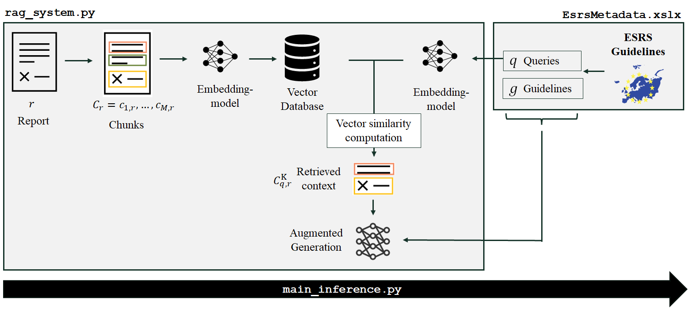

# ESRS Disclosure Analysis using Retrieval-Augmented Generation (RAG)

This repository contains the code, data, and documentation accompanying the master’s thesis **"Automating the Assessment of Corporate Sustainability Disclosures under the CSRD using Large Language Models"** by **Juliana Tonn**.

The project develops an **open-source Retrieval-Augmented Generation (RAG) framework** to automatically extract and evaluate sustainability disclosures in accordance with the **European Sustainability Reporting Standards (ESRS)** — specifically focusing on **ESRS S1 Own Workforce** indicators.  
It provides the first large-scale, automated analysis of early CSRD-aligned sustainability reports.

---

## Overview

Corporate sustainability reports are growing in complexity and scope under the new **Corporate Sustainability Reporting Directive (CSRD)**.  
Traditional manual analysis of ESG disclosures is time-consuming and inconsistent. This project explores how **Large Language Models (LLMs)** — enhanced through **Retrieval-Augmented Generation (RAG)** — can automate and scale the evaluation of qualitative sustainability disclosures.

The framework achieves an **accuracy of 76.9%** in detecting ESRS-aligned disclosures and demonstrates that **lightweight, open-source LLMs** can deliver competitive results when properly configured for domain-specific ESG tasks.

---

## RAG Pipeline

The RAG system retrieves relevant text sections from corporate sustainability reports and evaluates whether the disclosed content aligns with ESRS S1 requirements.

<p align="center">
  
</p>

### Key Components
- **Retrieval**: Extracts context passages from PDF sustainability reports.
- **Augmentation**: Supplies relevant external ESRS metadata for grounding.
- **Generation**: Uses an LLM to assess disclosure compliance.
- **Evaluation**: Measures accuracy and coverage using a manually coded validation dataset.

---

## Running the Inference

To perform automated disclosure analysis, use:

```bash
python main_inference.py
