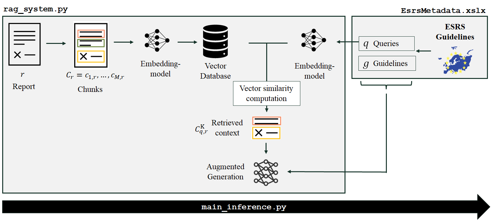

# ESRS Disclosure Analysis using Retrieval-Augmented Generation (RAG)

This repository contains the code, data, and documentation accompanying the master’s thesis **"Automating the Assessment of Corporate Sustainability Disclosures under the CSRD using Large Language Models"** by Juliana Tonn. Handed in for the Master Examination in Data Science in Business and Economics of the Eberhard Karls Universität Tübingen.

The project develops an **open-source Retrieval-Augmented Generation (RAG) framework** to automatically extract and evaluate sustainability disclosures in accordance with the **European Sustainability Reporting Standards (ESRS)** — specifically focusing on **ESRS S1 Own Workforce** indicators.  
It provides the first large-scale, automated analysis of early CSRD-aligned sustainability reports.

## RAG Pipeline

The RAG system retrieves relevant text sections from corporate sustainability reports and evaluates whether the disclosed content aligns with ESRS S1 requirements.

  

## Directories
- **rag_system.py**: 
- **EsrsMetadata.xlsx**: 
- **main_inference.py**: the script to run the automated disclosure analysis

- performance_evaluation:
  - validation_dataset.xslx: hand-coded validation set
  - sample_reports/*: containing the two sample reports the validation set was based upon
  - prompt_exploration.ipynb: exploration of the performance of different prompt templates, system prompts, queries & guidelines
  - rag_comparison.ipynb: compare performance of different rag system settings (model benchmarking, prompt modules, PDF text extraction, retrieval settings)

- data:
  - get_reports.ipynb: prepare dataset with reports and links that is used for inference
  - SRN-CSRD_report_archive - csrd.csv: downloaded esrs conform report dataset from SRN
  - all_results.jsonl: inference results
  - visualize_data.ipynb: prepare company data and inference results for the analysis (plots, summary statistics)

## Acknowledgements
The author acknowledges support by the state of Baden-Württemberg through bwHPC and the German Research Foundation (DFG) through grant INST 35/1597-1 FUGG for providing computational resources.

--- 
## Contact
For questions, feedback, or collaborations please reach out juliana.tonn@student.uni-tuebingen.de.